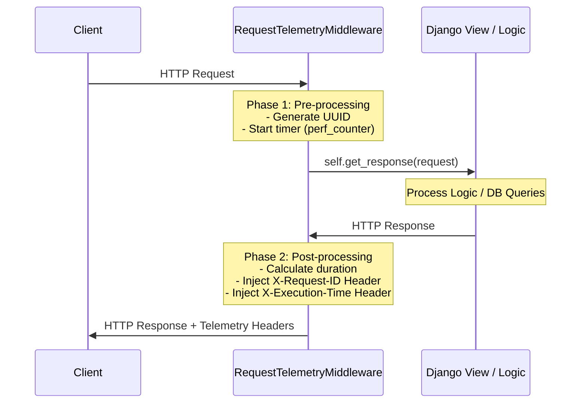

To integrate the `RequestTelemetryMiddleware` into your Django project, we must follow a two-step "Define and Register" process. This decomposition breaks down the code logic and its lifecycle within the Django "Onion" architecture.

### 1. Integration Flowchart
The following Mermaid diagram visualizes how this middleware wraps around your application logic. Note how it captures data both **before** the view executes and **after** it returns.



---

### 2. Implementation: `orders/middleware.py`
You should replace or append to your existing `SimpleLoggingMiddleware` in `orders/middleware.py`.

**Architect's Note on Code Logic:**
* **Type Hinting:** We use `Callable[[HttpRequest], HttpResponse]` to define the `get_response` contract, ensuring type safety.
* **`uuid.uuid4()`**: Generates a cryptographically strong unique ID. Attaching it to `request.request_id` makes it available to your views for logging or debugging.
* **`time.perf_counter()`**: Unlike `time.time()`, this is a monotonic clock. It is immune to system clock updates, making it the standard for high-precision performance measurement.

---

### 3. Registration: `myproject/settings.py`
To activate the middleware, you must add its Python path to the `MIDDLEWARE` list in `settings.py`. 

```python
# myproject/settings.py

MIDDLEWARE = [
    'django.middleware.security.SecurityMiddleware',
    'django.contrib.sessions.middleware.SessionMiddleware',
    'django.middleware.common.CommonMiddleware',
    'django.middleware.csrf.CsrfViewMiddleware',
    'django.contrib.auth.middleware.AuthenticationMiddleware',
    'django.contrib.messages.middleware.MessageMiddleware',
    # Registration Point:
    'orders.middleware.RequestTelemetryMiddleware', 
]
```

**Why the order matters:**
Middleware is executed in the order it is listed during the **request** phase and in **reverse order** during the **response** phase. By placing `RequestTelemetryMiddleware` at the bottom:
1.  **Request Phase:** It runs *after* authentication and session logic, meaning it measures the performance of the view and any logic closer to the core.
2.  **Response Phase:** It is one of the *first* to process the response coming back from the view, ensuring the telemetry headers are attached before higher-level security or caching layers potentially intercept the response.

---

### 4. Why This Integration is "Pythonic"

* **Closure-based Design:** Modern Django middleware (1.10+) uses a functional approach. The `__init__` method accepts a callable (`get_response`), and `__call__` acts as a wrapper. This is essentially a class-based decorator.
* **Duck Typing and Attribute Injection:** We dynamically add `request_id` to the `request` object. While some prefer strict structures, in the Django ecosystem, this is the idiomatic way to pass metadata across the request lifecycle without modifying the core `HttpRequest` class definition.
* **EAFP (Easier to Ask Forgiveness than Permission):** If you were to add more complex logic (like logging to a file), a Pythonic architect would wrap the `self.get_response(request)` in a `try/except` block to ensure that even if the telemetry fails, the user still receives their response.