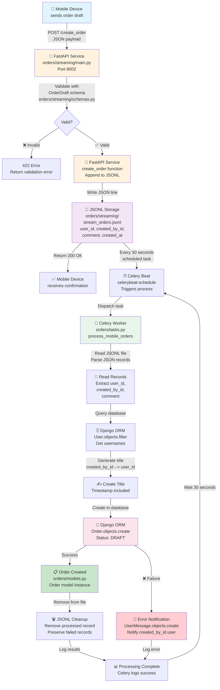
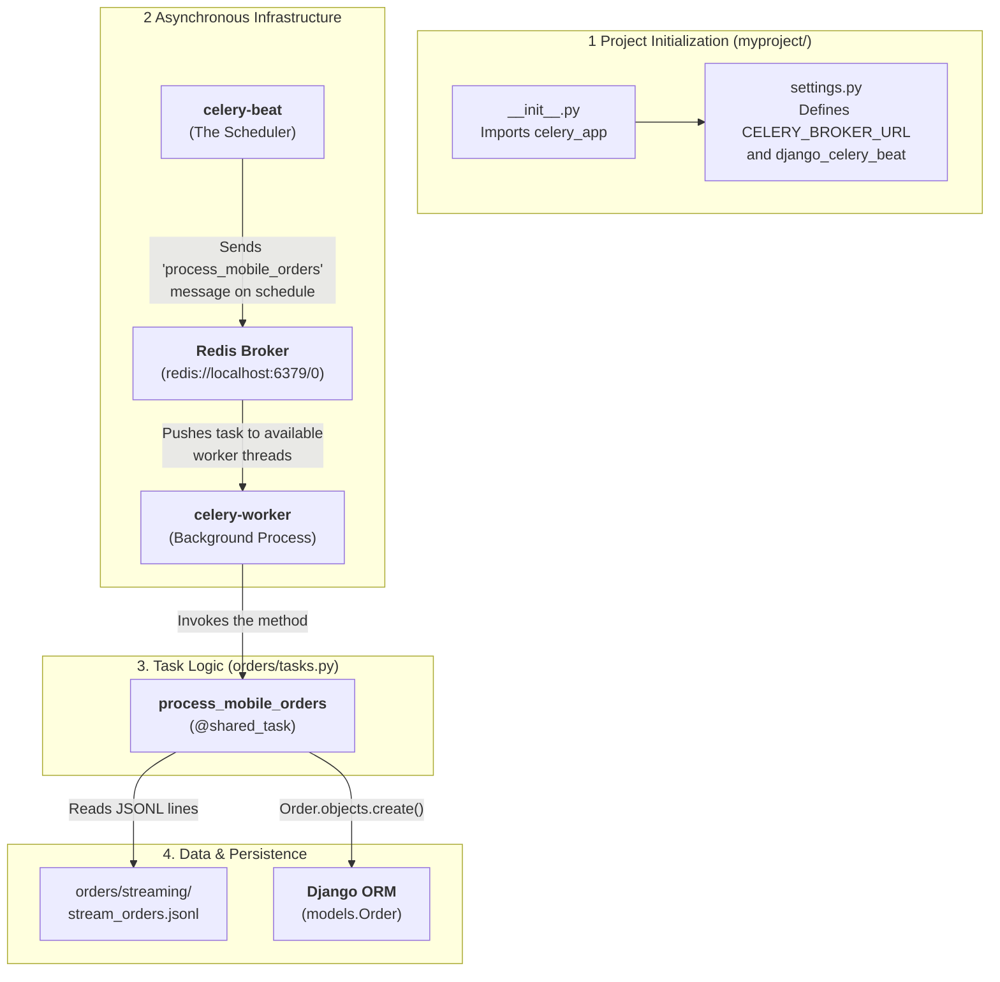

# Mobile Order Streaming Flow Diagram
## Complete Workflow: Mobile Device → Streaming Service → Celery → Django

Architectural Rationale:
1. Separation of Concerns
   - orders/streaming/ = Input Layer (FastAPI microservice)
     - Only responsible for receiving and validating mobile order drafts
     - Writes to JSONL file
     - Isolated from Django ecosystem
   
   - orders/ = Processing & Business Logic Layer (Django app)
     - Celery tasks belong here because they interact with Django ORM
     - Need access to Django models (Order, User, UserMessage)
     - Part of the main application, not the streaming microservice
2. Service Isolation
   - orders/streaming/ could theoretically be deployed as a separate microservice
     - Doesn't require Django
     - Uses only FastAPI and Pydantic
     - Could live in its own container/service
   
   - orders/tasks.py requires Django
     - Must be part of the Django application
     - Runs in the same context as Django models
     - Uses the Django ORM directly
3. Dependency Graph
      orders/streaming/main.py
   ├── No Django dependencies
   ├── Only: FastAPI, Pydantic, os, json
   └── Output: stream_orders.jsonl
   
   orders/tasks.py
   ├── Django dependencies ✓
   ├── Celery dependencies ✓
   ├── ORM imports ✓
   └── Processes: stream_orders.jsonl → Django Database
   
4. Scalability Pattern
   - If you wanted to scale, you could:
     - Run multiple orders/streaming instances for load distribution
     - Run multiple Celery workers processing tasks from tasks.py
     - Deploy them independently without coupling
5. File System Organization
      orders/
   ├── models.py          ← Data models
   ├── views.py           ← Web views
   ├── tasks.py           ← Async tasks ✓ (Celery integration)
   ├── forms.py
   └── streaming/         ← Separate microservice
       ├── main.py        ← FastAPI endpoint
       ├── schemas.py     ← Pydantic models
       └── stream_orders.jsonl ← Data exchange format
   
Alternative Approach & Why It Wasn't Chosen:
If tasks.py were in orders/streaming/:
- ❌ Would create tight coupling between streaming and processing
- ❌ Would force Django dependencies on a potentially standalone service
- ❌ Blurs responsibility boundaries
- ❌ Makes it harder to reason about which layer does what
Best Practice Principle:
This follows the Layered Architecture Pattern:
Presentation Layer (FastAPI/Streaming)
          ↓
Data Exchange Layer (JSONL file)
          ↓
Processing Layer (Celery tasks)
          ↓
Persistence Layer (Django ORM / Database)
Each layer has clear responsibilities and minimal dependencies on other layers.
---

# Celery async part

Here is the step-by-step technical breakdown of that flow as it happens in your code:
1. The Producer: Celery Beat (The Scheduler)

Celery Beat is a process that constantly checks your schedule (defined in settings.py via django_celery_beat).

    When the "clock" hits the 30-second mark for the process_mobile_orders task, Beat doesn't run the code itself.

    Instead, it creates a small message (a "task signal") containing the name of the function to run and any required arguments.

    The Action: Beat "publishes" this message to the Broker.

2. The Mailbox: The Broker (Redis)

Your project uses Redis as the broker, configured at redis://localhost:6379/0.

    The Broker receives the message from Beat and places it into a queue.

    The task stays in this queue until a worker is ready to handle it. This is why it's "asynchronous"—the scheduler (Beat) is already finished with its job once the message is in Redis; it doesn't wait for the task to actually complete.

3. The Consumer: Celery Worker

The Worker is a separate process (or multiple processes) that you start using a command like celery -A myproject worker.

    Monitoring: The Worker constantly watches the Redis queue for new messages.

    Execution: When it sees the process_mobile_orders message, it "claims" it, pulls the definition from orders/tasks.py, and executes the Python code.

    Result: The Worker is the one that actually performs the disk I/O (reading stream_orders.jsonl) and database writes (Order.objects.create).

Why this is better than a simple script:

    Independence: If your Django web server is under heavy load, the Beat/Worker cycle continues unaffected in the background.

    Reliability: If the Worker crashes while processing an order, the message can remain in the Broker (depending on your configuration) to be retried later, rather than the data being lost.

    Scalability: If you suddenly have millions of mobile orders, you can start 10 more Worker processes on different servers, and they will all pull from the same Redis Broker to clear the queue faster.