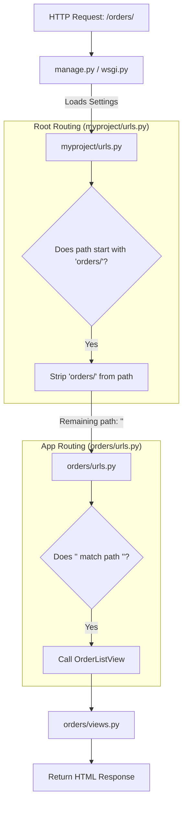
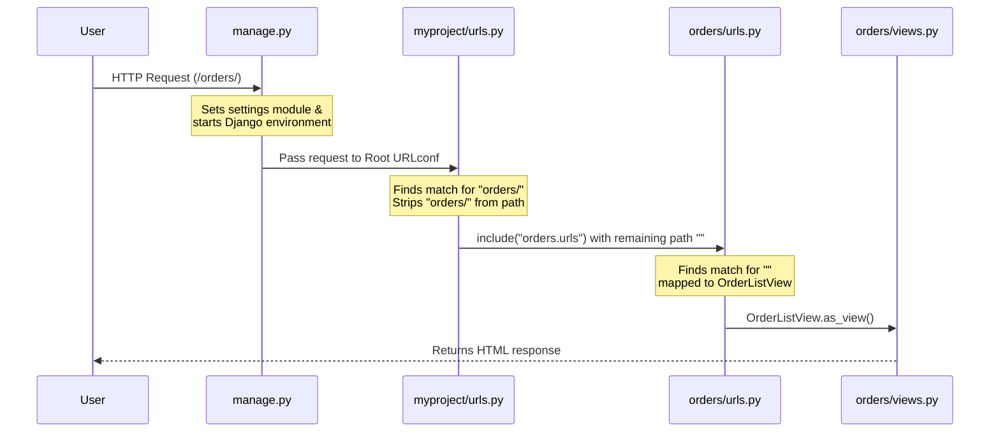

When a request is received by a Django application, it follows a specific routing hierarchy. Here is an explanation of how `manage.py`, `myproject/urls.py`, and `orders/urls.py` interact based on your project files:

### 1. manage.py: The Entry Point
`manage.py` is the command-line utility for your project. When you run the server, it sets the `DJANGO_SETTINGS_MODULE` to `myproject.settings`. This tells Django where to find the `ROOT_URLCONF`, which in your case is `myproject.urls`.

### 2. myproject/urls.py: The Root Router
This is the "main" URL configuration for the entire website. 
* It acts as a high-level dispatcher.
* It sees a request starting with `orders/` and uses the `include()` function to hand over control to the `orders.urls` module.
* The comment in the code notes that this prefix was added to keep the `orders` app separate from others.

### 3. orders/urls.py: The App Router
Once the root router strips away the `orders/` prefix, the remaining part of the URL is passed here.
* Because your path is `path("", ...)`, it matches the "empty" remainder.
* For example, a request for `/orders/` matches the `orders/` prefix in the root and the `""` in the app-level file.
* It then calls `OrderListView.as_view()` to handle the logic and return the response.

### Request Flow Diagram

The following Mermaid diagram illustrates how a request for `yourdomain.com/orders/` flows through these specific files:

