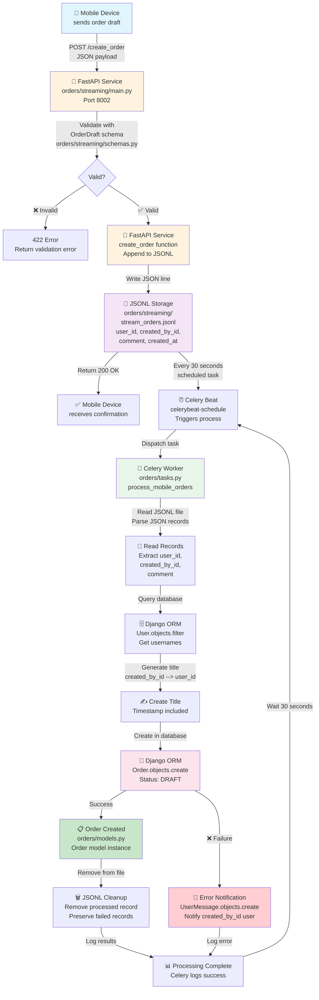

# Mobile Order Streaming Flow Diagram

## Complete Workflow: Mobile Device → Streaming Service → Celery → Django



## Component Details

### 1. **Mobile Device** 
- Sends JSON payload with order draft
- Contains: `user_id`, `created_by_id`, `comment`

### 2. **FastAPI Streaming Service** (`orders/streaming/main.py`)
- **Class**: FastAPI application
- **Method**: `create_order(order: OrderDraft)`
- **Action**: Validates input and appends to JSONL file
- **Returns**: 200 OK or 422 Validation Error

### 3. **Pydantic Schema** (`orders/streaming/schemas.py`)
- **Class**: `OrderDraft`
- **Fields**: `user_id`, `created_by_id`, `comment`, `created_at`
- **Action**: Validates incoming payload structure

### 4. **JSONL Storage** (`orders/streaming/stream_orders.jsonl`)
- **Format**: JSON Lines (one JSON object per line)
- **Content**: Mobile order drafts waiting for processing
- **Lifecycle**: Records added → processed → removed

### 5. **Celery Beat Scheduler** (`celerybeat-schedule`)
- **Type**: GNU dbm database
- **Role**: Maintains periodic task schedule
- **Interval**: 30 seconds for `process_mobile_orders`

### 6. **Celery Worker** (`orders/tasks.py`)
- **Function**: `process_mobile_orders()`
- **Decorator**: `@shared_task`
- **Actions**:
  1. Read JSONL file
  2. Parse each JSON record
  3. Query User model for usernames
  4. Generate dynamic title
  5. Create Order with DRAFT status
  6. Handle errors
  7. Remove processed records

### 7. **Django ORM** (`orders/models.py`)
- **Classes**: 
  - `Order`: Main order entity
  - `User`: Built-in Django user model
  - `UserMessage`: For error notifications
- **Methods**:
  - `Order.objects.create()`: Create new order
  - `User.objects.filter()`: Get user information
  - `UserMessage.objects.create()`: Create error notification

### 8. **Error Handling**
- **Failed orders**: Preserved in JSONL for manual review
- **Notifications**: `UserMessage` created for order creator
- **Logging**: Errors logged to `orders_processing.log`

## Key File References

| File | Purpose | Type |
|------|---------|------|
| `orders/streaming/main.py` | FastAPI endpoint | Python Module |
| `orders/streaming/schemas.py` | Pydantic validation | Python Module |
| `orders/streaming/stream_orders.jsonl` | Order draft storage | JSON Lines |
| `orders/tasks.py` | Celery task logic | Python Module |
| `orders/models.py` | Django models | Python Module |
| `orders/apps.py` | Celery Beat config | Python Module |
| `celerybeat-schedule` | Schedule state DB | Binary dbm |
| `myproject/settings.py` | Celery settings | Python Module |

## Data Flow Summary

```
Mobile Device → FastAPI (Port 8002)
    ↓
Validation (Pydantic)
    ↓
JSONL Storage
    ↓
Celery Beat (every 30s)
    ↓
Celery Worker Task
    ↓
Django ORM
    ↓
Order Created (DRAFT) or Error Notification
    ↓
JSONL Cleanup
```
