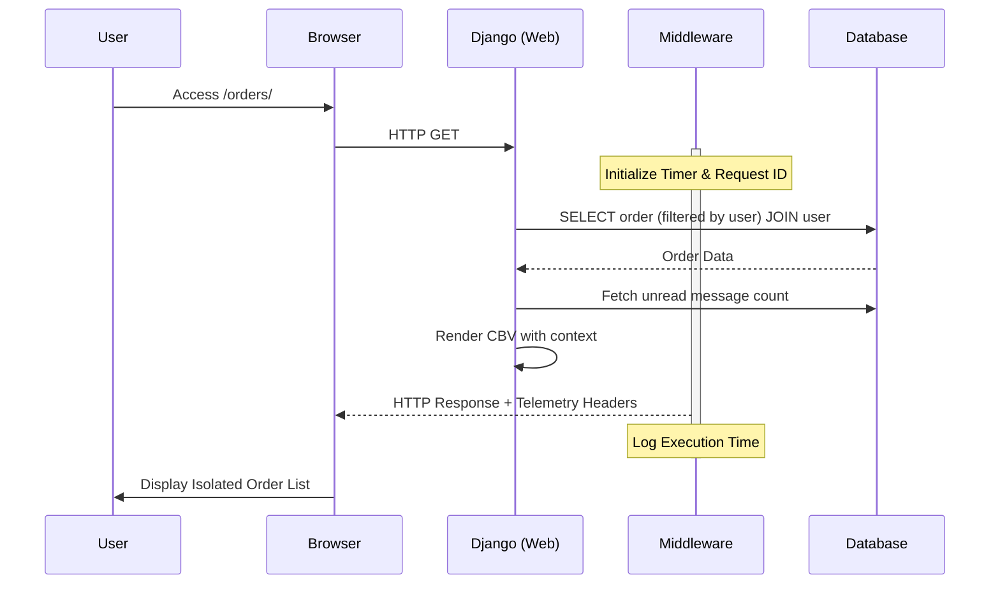
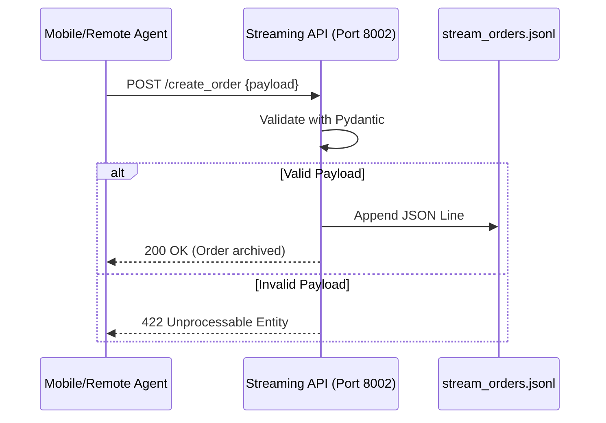

# Product Specification: Order Management

## Overview
The `rabbiMQ` system is a Django-based application designed for efficient order lifecycle management. It prioritizes performance through optimized query patterns and provides deep visibility into request performance via custom telemetry.

## Core Domain Logic
The system is built around the **Order** entity, which serves as the primary unit of data.

### 1. Order & Product Catalog
*   **Order Entity**: Tracks `title`, `amount`, `status`, `owner`, `created_by`, and `comment`. 
*   **Inventory**: A catalog of available products with `name`, `price`, and `commentary`.
*   **Order Items**: A bridge entity allowing multiple `Inventory` items to be linked to a single `Order` with specific quantities.
*   **Lifecycle**: Orders progress through `draft`, `pending`, `assembling`, `shipping`, `completed`, and `cancelled` states.
*   **User Association**: Every order is owned by a specific user.

### 2. Notification System
The system automatically generates **UserMessages** (Notifications) for critical events:
*   **Status Changes**: Notifies the order owner when an order status is updated.
*   **Delegated Creation**: Notifies a user if a staff member creates an order on their behalf.
*   **Inbox Utility**: Users have a dedicated inbox to view and acknowledge (mark as read) notifications.

### 3. Data Isolation (Access Control)
To ensure multi-tenant security:
*   **Regular Users**: Can only see, update, or delete orders they own. They can only see notifications sent to them.
*   **Staff Users**: Have global visibility and can manage orders for any user.

### 4. Performance Engineering (Solving N+1)
A critical feature of the system is the intensive use of `select_related()` and `prefetch_related()`.
*   **Order List**: Uses `select_related('user')`.
*   **Order Detail**: Uses `select_related('user').prefetch_related('items__inventory')` to fetch the full order tree in minimal queries.

### 5. Execution Telemetry
The system includes a custom `RequestTelemetryMiddleware`. This middleware:
*   Generates or carries forward a unique `Request-ID`.
*   Measures the execution time of the request.
*   Attaches this metadata to the response headers for monitoring and debugging purposes.
38: 
### 6. Order Streaming (Microservice)
To handle remote order ingestion (e.g., from mobile agents) without overloading the main Django monolith:
*   **FastAPI Ingestion**: A dedicated service exposes `POST /create_order`.
*   **Validation**: Uses Pydantic to ensure incoming drafts match the required schema.
*   **Durable Storage**: Ingested drafts are stored in `stream_orders.jsonl` (JSON Lines format) for later manual or automated ingestion into the primary database.

### 7. Mobile Order Synchronization
An asynchronous solution for processing mobile order drafts:
*   **Celery Task**: `process_mobile_orders` runs every 30 seconds
*   **Key Operations**:
    - Read records from `stream_orders.jsonl`
    - Create draft orders in Django
    - Generate dynamic order titles
*   **Title Generation**: `{created_by_id} --> {user_id}`
*   **Performance Features**:
    - Direct database querying
    - Efficient error handling
    - Minimal external dependencies
*   **Components**:
    - Celery Worker: Processes order drafts
    - Celery Beat: Schedules periodic task
    - Redis: Message broker

## UI/UX Delivery
The application uses **Django Class-Based Views (CBVs)** for its web interface, ensuring a consistent and DRY (Don't Repeat Yourself) approach to rendering templates and handling form submissions.

## Future Roadmap
*   **Asynchronous Tasks**: Integration of **Celery** to handle non-blocking side effects (e.g., sending email notifications on order completion).
*   **Message Broker**: Adoption of **Redis** to facilitate communication between the Django web service and Celery workers.
*   **Enhanced Security**: Moving the `SECRET_KEY` and other sensitive configurations to environment variables.

---

## Technical Flow Diagram

### Order Streaming Flow (FastAPI)

