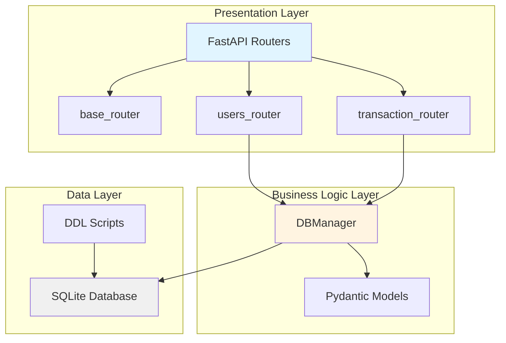

# Project Overview

## 📋 Project Summary

**Financial Tracker API** is a RESTful API application built with FastAPI that provides comprehensive CRUD operations for managing users and financial transactions. The application uses SQLite as its database backend and Pydantic for data validation.

## 🎯 Purpose

This application serves as a personal finance tracking system that allows users to:
- Manage user accounts
- Track financial transactions with categorization
- Query and analyze transaction history
- Maintain data integrity through validation

## 🏗️ Architecture

The application follows a **layered architecture** pattern:



### Key Architectural Decisions

1. **Context Manager Pattern**: Database connections use Python's context manager protocol (`with` statement) for automatic resource management
2. **Pydantic Validation**: All data models use Pydantic for automatic validation and serialization
3. **Lifespan Management**: FastAPI lifespan events ensure proper database initialization on startup
4. **Separation of Concerns**: Clear separation between routing, business logic, and data access layers

## 📁 Directory Structure

```
fin_app/
├── __init__.py                 # Package initialization, exports create_app
├── main.py                     # Application entry point
├── extra/
│   └── create_app.py          # FastAPI application factory
├── settings/
│   └── config.py              # Configuration and environment variables
├── models/
│   ├── user.py                # User Pydantic model
│   └── transaction.py         # Transaction and Category models
├── routers/
│   ├── base.py                # Root endpoint (HTML welcome page)
│   ├── users.py               # User CRUD endpoints
│   └── transactions.py        # Transaction CRUD endpoints
└── db/
    ├── db_manager.py          # Database operations manager
    └── db_scripts_DDL.py      # Database schema definitions
```

## 🔧 Key Technologies

| Technology | Version | Purpose |
|------------|---------|---------|
| **FastAPI** | ≥0.129.0 | Modern web framework for building APIs |
| **Pydantic** | ≥2.12.5 | Data validation and settings management |
| **Uvicorn** | ≥0.40.0 | ASGI server for running FastAPI |
| **Typer** | ≥0.23.1 | CLI framework (dependency) |
| **SQLite** | 3.x | Embedded relational database |
| **Python** | ≥3.14 | Programming language |

## 🚀 Quick Start

### Running the Application

```bash
# Using uv (recommended)
uv run uvicorn fin_app.main:app --reload

# Run in background with logging
uv run uvicorn fin_app.main:app --reload > server.log 2>&1 &
```

### Stopping the Server

```bash
# Kill uvicorn process
pkill -f uvicorn

# Kill process on port 8000
kill $(lsof -ti:8000)

# Alternative method
fuser -k 8000/tcp
```

### Accessing the API

- **Root Page**: http://127.0.0.1:8000/
- **Interactive Docs**: http://127.0.0.1:8000/docs
- **ReDoc**: http://127.0.0.1:8000/redoc

## 🔐 Configuration

The application uses environment variables for configuration (see [[config.py]]):

| Variable | Default | Description |
|----------|---------|-------------|
| `APP_HOST` | 127.0.0.1 | Server host address |
| `APP_PORT` | 8000 | Server port |
| `DB_PATH` | ./data/fin_app.db | SQLite database file path |

## 📊 Data Models

### Core Entities

1. **User** - Represents application users
   - Fields: id, name, email, created, updated
   - See [[spec_pydantic.md]] for details

2. **Transaction** - Represents financial transactions
   - Fields: id, user_id, amount, category, description, created, updated
   - Categories: Food, Transport, Housing, Entertainment, Other
   - See [[spec_pydantic.md]] for details

## 🔄 API Endpoints

### Users
- `POST /users` - Create new user
- `GET /user/{user_id}` - Get user by ID
- `GET /users` - List all users
- `PUT /users/{user_id}` - Update user
- `DELETE /users/{user_id}` - Delete user

### Transactions
- `POST /transaction` - Create new transaction
- `GET /transaction/{transaction_id}` - Get transaction by ID
- `GET /transactions` - List all transactions
- `PUT /transaction/{transaction_id}` - Update transaction
- `DELETE /transaction/{transaction_id}` - Delete transaction

For detailed endpoint specifications, see [[spec_server.md]].

## 📚 Further Documentation

- **Module Analysis**: [[01_Module_Analysis.md]] - Detailed module breakdown
- **Data Flow**: [[02_Data_Flow.md]] - Request/response lifecycle
- **Onboarding Guide**: [[03_Onboarding_Guide.md]] - Developer setup guide
- **Component Specs**: See `spec/detailed/` for component-specific documentation

## 🎓 Learning Resources

This project demonstrates:
- FastAPI best practices
- RESTful API design
- Database context managers
- Pydantic validation patterns
- Application factory pattern
- Lifespan event handling
