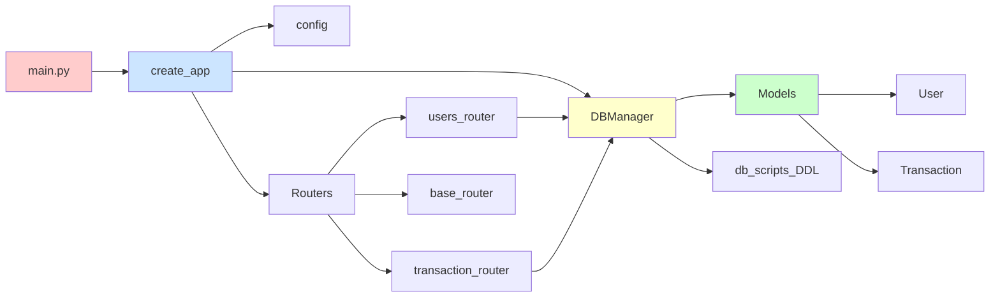
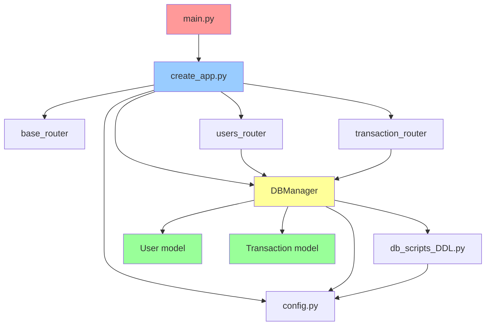

# Module Analysis

This document provides a comprehensive map of all modules in the Financial Tracker application, their responsibilities, and interdependencies.

## 📦 Module Overview

## 🎯 Core Modules

### 1. Application Entry Point

#### `main.py`
- **Purpose**: Application entry point and server launcher
- **Key Components**:
  - Imports `create_app()` factory function
  - Configures uvicorn server with host/port from config
  - Provides direct execution capability
- **Dependencies**: [[create_app.py]], [[config.py]]
- **Details**: See [[spec_server.md#main-entry-point]]

---

### 2. Application Factory

#### `extra/create_app.py`
- **Purpose**: FastAPI application factory with lifespan management
- **Key Components**:
  - `create_app()` - Factory function that creates configured FastAPI instance
  - `lifespan()` - Async context manager for startup/shutdown events
  - Logging configuration
- **Responsibilities**:
  - Initialize FastAPI application with metadata
  - Register all routers
  - Manage database initialization on startup
  - Handle graceful shutdown
- **Dependencies**: All routers, [[DBManager]], [[config.py]]
- **Details**: See [[spec_server.md#application-factory]]

---

### 3. Configuration

#### `settings/config.py`
- **Purpose**: Centralized configuration management
- **Environment Variables**:
  - `APP_HOST` - Server host (default: 127.0.0.1)
  - `APP_PORT` - Server port (default: 8000)
  - `DB_PATH` - Database file path (default: ./data/fin_app.db)
- **Usage**: Imported by multiple modules for consistent configuration
- **Details**: See [[spec_core_logic.md#configuration]]

---

## 🌐 Routing Layer

### 4. Base Router

#### `routers/base.py`
- **Purpose**: Root endpoint providing welcome page
- **Endpoints**:
  - `GET /` - Returns HTML welcome page with link to docs
- **Response Type**: HTMLResponse
- **Details**: See [[spec_server.md#base-router]]

### 5. Users Router

#### `routers/users.py`
- **Purpose**: User management endpoints
- **Endpoints**:
  - `POST /users` - Create user
  - `GET /user/{user_id}` - Get single user
  - `GET /users` - List all users
  - `PUT /users/{user_id}` - Update user
  - `DELETE /users/{user_id}` - Delete user
- **Dependencies**: [[DBManager]]
- **Error Handling**: Returns 404 for non-existent users
- **Details**: See [[spec_server.md#users-router]]

### 6. Transactions Router

#### `routers/transactions.py`
- **Purpose**: Transaction management endpoints
- **Endpoints**:
  - `POST /transaction` - Create transaction
  - `GET /transaction/{transaction_id}` - Get single transaction
  - `GET /transactions` - List all transactions
  - `PUT /transaction/{transaction_id}` - Update transaction
  - `DELETE /transaction/{transaction_id}` - Delete transaction
- **Dependencies**: [[DBManager]]
- **Validation**: Uses Pydantic models for input validation
- **Error Handling**: Returns 404 for non-existent transactions
- **Details**: See [[spec_server.md#transactions-router]]

---

## 💾 Data Access Layer

### 7. Database Manager

#### `db/db_manager.py`
- **Purpose**: Centralized database operations with context manager pattern
- **Key Features**:
  - Context manager protocol (`__enter__`, `__exit__`)
  - Automatic database initialization if not exists
  - Connection management
  - CRUD operations for users and transactions
- **Methods**:
  - **Users**: `add_user()`, `get_user()`, `list_users()`, `update_user()`, `delete_user()`
  - **Transactions**: `add_transaction()`, `get_transaction()`, `list_transactions()`, `update_transaction()`, `delete_transaction()`
- **Dependencies**: [[User]], [[Transaction]], [[db_scripts_DDL]], [[config.py]]
- **Details**: See [[spec_database.md]]

### 8. Database Schema

#### `db/db_scripts_DDL.py`
- **Purpose**: Database schema definitions and initialization
- **Tables**:
  - `users` - User accounts
  - `transactions` - Financial transactions with foreign key to users
  - `categories` - Category reference table (defined but not actively used)
- **Key Function**: `init_db()` - Creates database and tables
- **Details**: See [[spec_database.md#schema]]

---

## 📊 Data Models

### 9. User Model

#### `models/user.py`
- **Purpose**: User data validation and serialization
- **Base Class**: `pydantic.BaseModel`
- **Fields**:
  - `id: int` - User identifier
  - `name: str` - User name
  - `email: str` - User email
  - `created: datetime` - Creation timestamp
  - `updated: datetime` - Last update timestamp
- **Details**: See [[spec_pydantic.md#user-model]]

### 10. Transaction Model

#### `models/transaction.py`
- **Purpose**: Transaction data validation and serialization
- **Base Class**: `pydantic.BaseModel`
- **Components**:
  - `Category` enum - Transaction categories (Food, Transport, Housing, Entertainment, Other)
  - `Transaction` model - Transaction data structure
- **Fields**:
  - `id: int | None` - Transaction identifier (optional for creation)
  - `user_id: int` - Associated user
  - `amount: float` - Transaction amount
  - `description: str` - Transaction description
  - `category: Category` - Transaction category
  - `created: datetime | None` - Creation timestamp
  - `updated: datetime | None` - Last update timestamp
- **Details**: See [[spec_pydantic.md#transaction-model]]

---

## 🔗 Module Dependencies

### Dependency Graph

### Import Hierarchy

**Level 0 (No dependencies)**:
- `settings/config.py`

**Level 1 (Depends only on Level 0)**:
- `models/user.py`
- `models/transaction.py`
- `db/db_scripts_DDL.py`

**Level 2 (Depends on Level 0-1)**:
- `db/db_manager.py`

**Level 3 (Depends on Level 0-2)**:
- `routers/base.py`
- `routers/users.py`
- `routers/transactions.py`

**Level 4 (Depends on Level 0-3)**:
- `extra/create_app.py`

**Level 5 (Top level)**:
- `main.py`

---

## 📝 Module Responsibilities Summary

| Module | Primary Responsibility | Secondary Responsibilities |
|--------|----------------------|---------------------------|
| `main.py` | Application entry point | Server configuration |
| `create_app.py` | Application factory | Lifespan management, router registration |
| `config.py` | Configuration management | Environment variable handling |
| `base.py` | Root endpoint | Welcome page HTML |
| `users.py` | User CRUD endpoints | Error handling |
| `transactions.py` | Transaction CRUD endpoints | Error handling, validation |
| `db_manager.py` | Database operations | Connection management, data conversion |
| `db_scripts_DDL.py` | Schema definition | Database initialization |
| `user.py` | User data model | Validation |
| `transaction.py` | Transaction data model | Category enum, validation |

---

## 🔍 Cross-Cutting Concerns

### Error Handling
- **Routers**: Use `HTTPException` for 404 errors
- **DBManager**: Returns `None` for not-found cases
- **Validation**: Pydantic handles validation errors automatically

### Logging
- Configured in [[create_app.py]]
- Logs startup, shutdown, and database status
- Format: `%(levelname)s - %(asctime)s - %(message)s`

### Resource Management
- Database connections use context managers (`with` statement)
- Automatic cleanup on exit
- Connection validation before operations

---

For detailed implementation specifications, see the component-specific documentation in `spec/detailed/`.
