# Data Flow

This document traces the complete lifecycle of data through the Financial Tracker application, from HTTP request to database and back.

## 🔄 Request-Response Lifecycle

### High-Level Flow

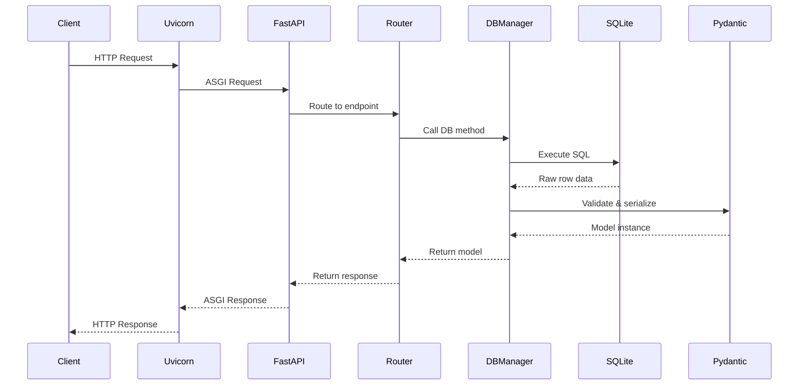

---

## 📥 Input Processing

### 1. User Creation Flow

**Endpoint**: `POST /users?name=John&email=john@example.com`

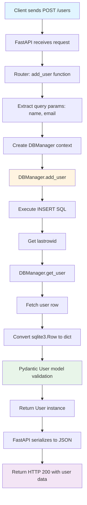

**Code Path**:
1. `routers/users.py::add_user()` - Receives request
2. `db/db_manager.py::add_user()` - Inserts into database
3. `db/db_manager.py::get_user()` - Retrieves created user
4. `models/user.py::User` - Validates and serializes data

**Data Transformations**:
```
Query Params (str, str)
  ↓
SQL Parameters (?, ?)
  ↓
sqlite3.Row (database row)
  ↓
dict (Python dictionary)
  ↓
User (Pydantic model)
  ↓
JSON (HTTP response)
```

---

### 2. Transaction Creation Flow

**Endpoint**: `POST /transaction?user_id=1&amount=50.0&category=Food&description=Lunch`

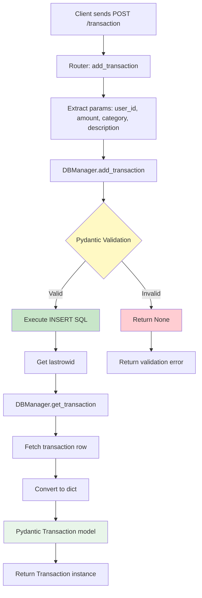

**Validation Layer**:
- **Pre-insert validation**: Transaction model validates data before SQL execution
- **Category validation**: Enum ensures only valid categories (Food, Transport, Housing, Entertainment, Other)
- **Type validation**: Pydantic ensures correct types (int, float, str)

**Code Path**:
1. `routers/transactions.py::add_transaction()` - Receives request
2. `db/db_manager.py::add_transaction()` - Validates with Pydantic
3. If valid: Insert into database
4. `db/db_manager.py::get_transaction()` - Retrieves created transaction
5. `models/transaction.py::Transaction` - Final validation and serialization

---

## 📤 Output Processing

### 3. User Retrieval Flow

**Endpoint**: `GET /user/1`

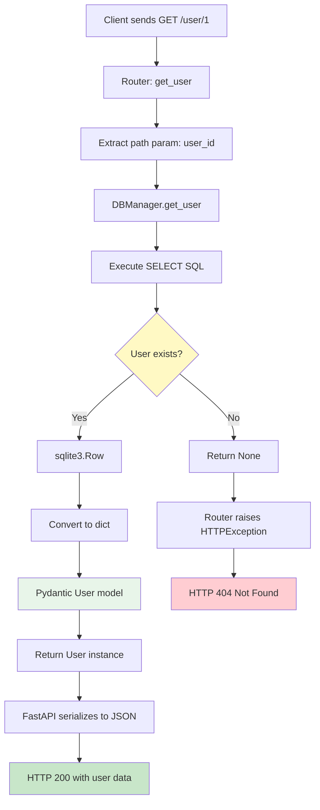

**Error Handling**:
- Database returns `None` if user not found
- Router checks for `None` and raises `HTTPException(status_code=404)`
- FastAPI converts exception to proper HTTP response

---

### 4. List Operations Flow

**Endpoint**: `GET /users`

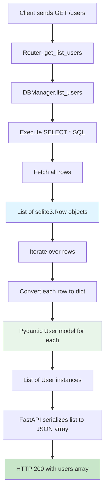

**Data Transformation**:
```
SQL Query
  ↓
List[sqlite3.Row]
  ↓
List[dict]
  ↓
List[User]
  ↓
JSON Array
```

---

## 🔄 Update Operations

### 5. User Update Flow

**Endpoint**: `PUT /users/1?name=Jane&email=jane@example.com`

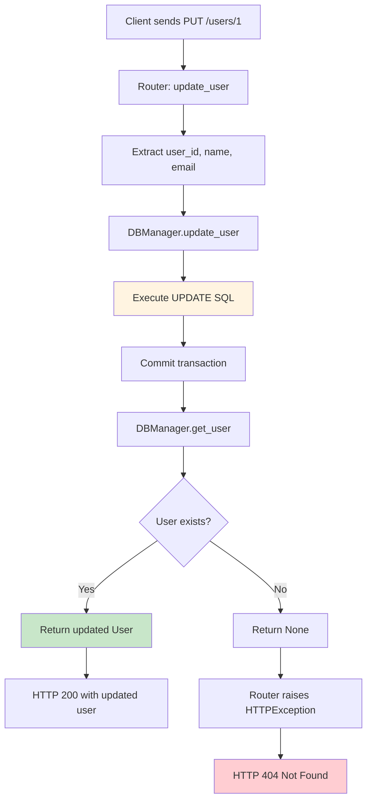

**Important Notes**:
- Update uses `CURRENT_TIMESTAMP` for `updated` field automatically
- Returns full user object after update for verification
- Validates existence after update to ensure operation succeeded

---

### 6. Transaction Update Flow

**Endpoint**: `PUT /transaction/1?user_id=1&amount=75.0&category=Transport&description=Taxi`

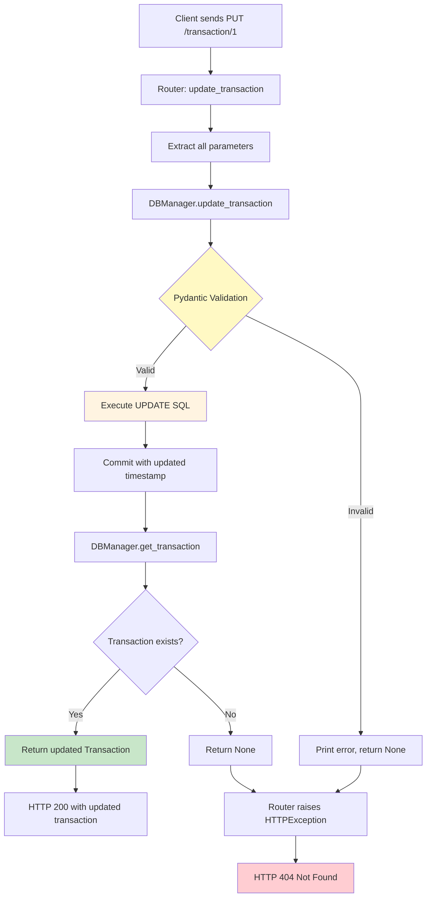

**Validation**:
- Pre-update validation ensures data integrity
- Prevents invalid data from reaching database
- Validation errors are logged but return generic 404 to client

---

## 🗑️ Delete Operations

### 7. Delete Flow

**Endpoint**: `DELETE /users/1` or `DELETE /transaction/1`

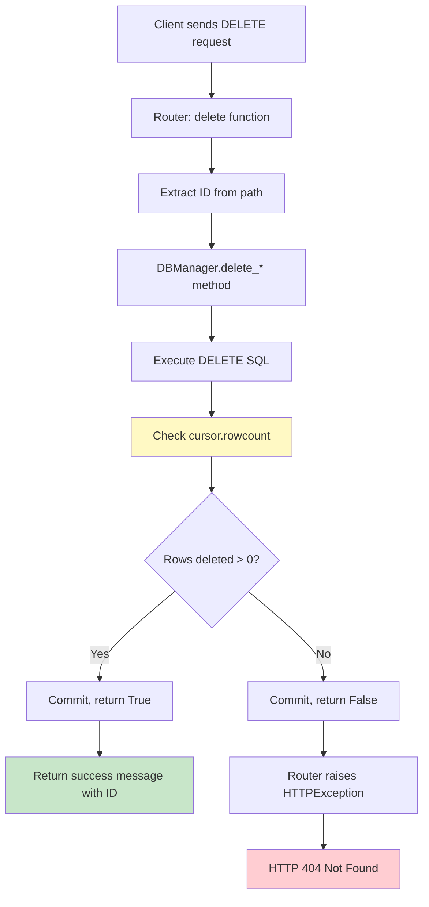

**Response Format** (Success):
```json
{
  "message": "User deleted successfully",
  "user_id": 1
}
```

---

## 🚀 Application Lifecycle

### Startup Sequence

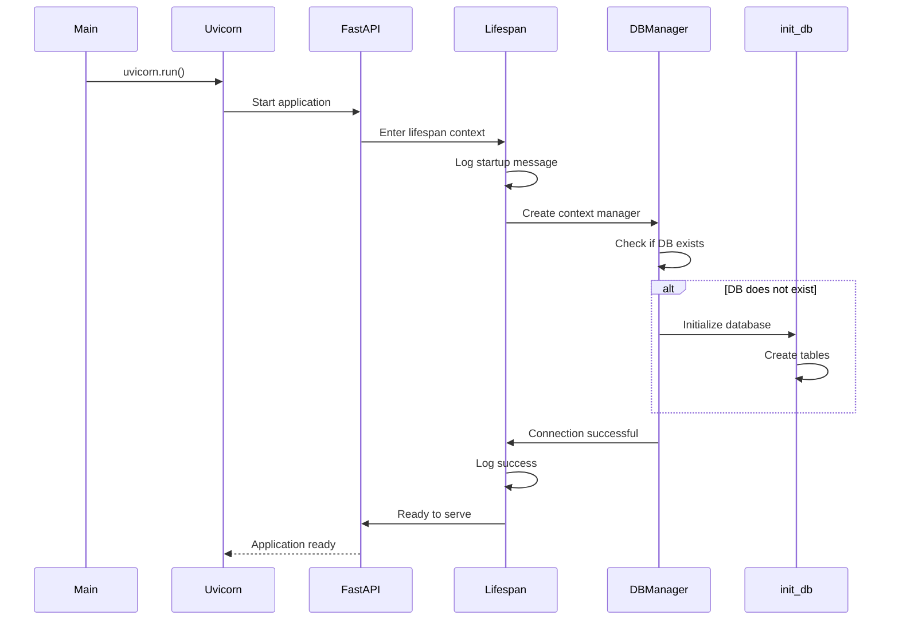

**Key Steps**:
1. `main.py` starts uvicorn server
2. FastAPI application created by `create_app()`
3. Lifespan context manager enters
4. Database connection tested
5. If database doesn't exist, `init_db()` creates it
6. Application ready to accept requests

---

### Shutdown Sequence

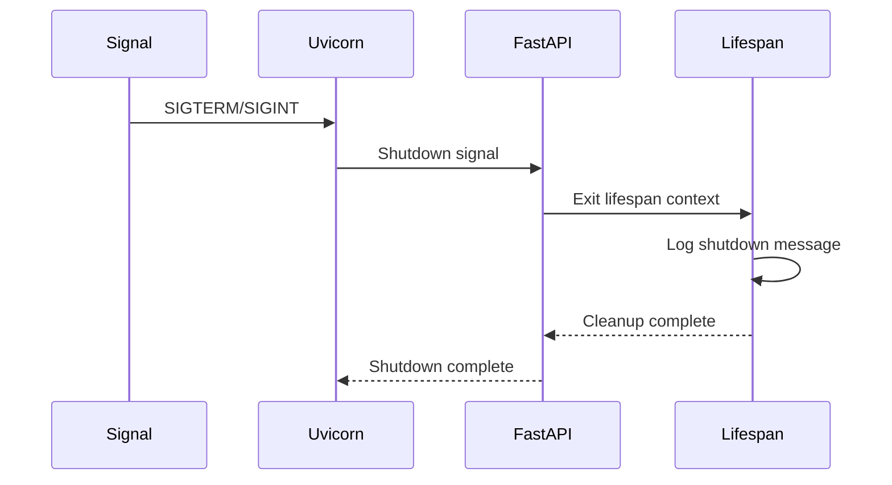

---

## 🔐 Data Validation Points

### Validation Layers

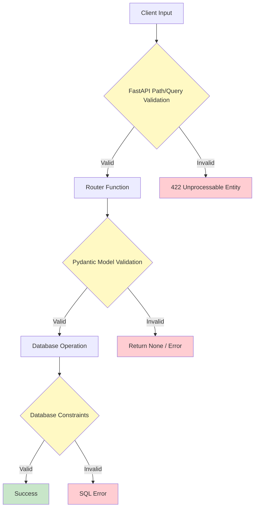

**Three Validation Layers**:
1. **FastAPI**: Type validation for path/query parameters
2. **Pydantic**: Model validation before database operations
3. **Database**: Constraints (foreign keys, NOT NULL, etc.)

---

## 📊 Data Format Transformations

### Complete Transformation Chain

```
HTTP Request (JSON/Query Params)
  ↓ FastAPI parsing
Python primitives (str, int, float)
  ↓ Pydantic validation (for transactions)
Pydantic Model (optional pre-insert)
  ↓ SQL parameter binding
SQL Parameters (?, ?, ?)
  ↓ SQLite execution
Database Row (sqlite3.Row)
  ↓ dict() conversion
Python Dictionary
  ↓ Pydantic model instantiation
Pydantic Model Instance
  ↓ FastAPI serialization
JSON Response
  ↓ HTTP
Client receives JSON
```

---

## 🔍 Key Observations

### Design Patterns
1. **Context Manager**: Ensures database connections are properly closed
2. **Repository Pattern**: DBManager abstracts database operations
3. **Data Transfer Objects**: Pydantic models serve as DTOs
4. **Validation Pipeline**: Multiple validation layers ensure data integrity

### Data Consistency
- Timestamps (`created`, `updated`) managed by database
- Foreign key constraints ensure referential integrity
- Pydantic validation prevents invalid data entry
- Transaction commits ensure atomic operations

### Error Propagation
- Database returns `None` for not-found cases
- Routers convert `None` to HTTP 404
- Validation errors logged but not exposed to client
- SQL errors would propagate as 500 errors (not currently handled)

---

For implementation details, see:
- [[spec_server.md]] - Router implementations
- [[spec_database.md]] - Database operations
- [[spec_pydantic.md]] - Model validation rules
