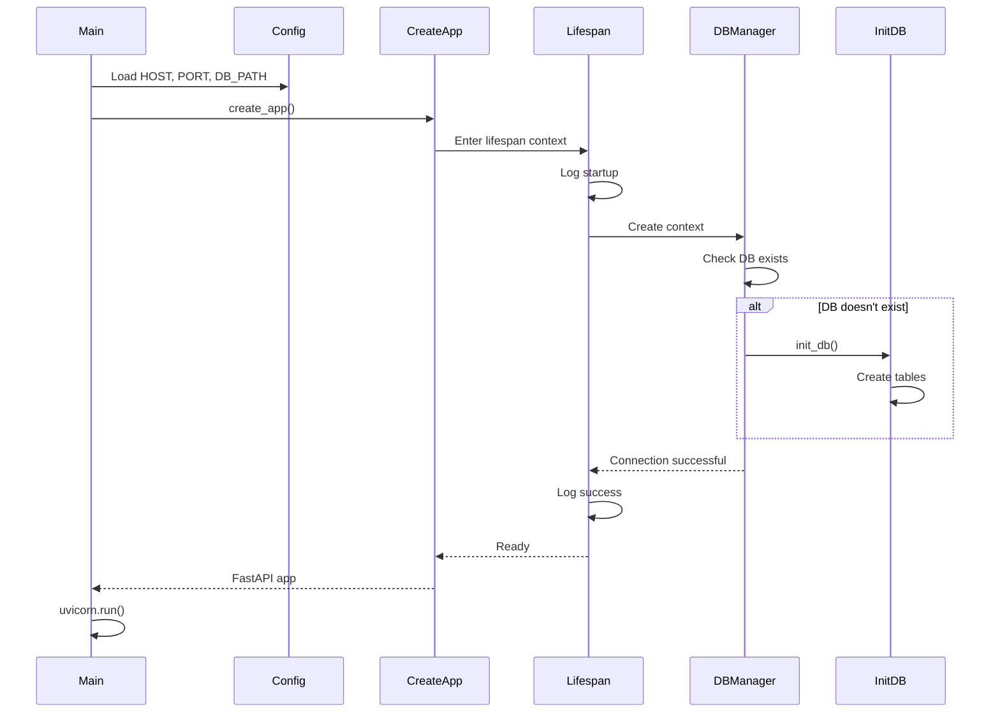
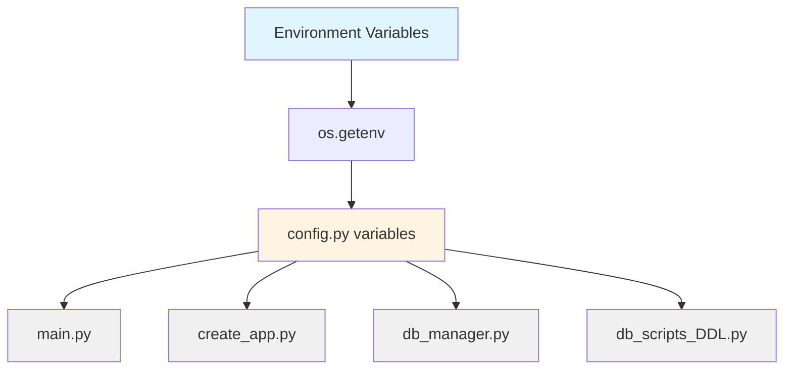

# Core Logic and Configuration Specification

This document covers the core application logic, configuration management, and utility components.

## 📋 Overview

This specification covers:
- Configuration management ([[config.py]])
- Application initialization ([[__init__.py]])
- Logging setup
- Environment variable handling

---

## ⚙️ Configuration

**File**: [[config.py]]

### Environment Variables

```python
import os

# SR: will be set as env variables APP_HOST and APP_PORT on docker
HOST = os.getenv("APP_HOST", "127.0.0.1")
PORT = os.getenv("APP_PORT", 8000)

DB_PATH = os.getenv("DB_PATH", "./data/fin_app.db")
```

### Configuration Variables

| Variable | Type | Default | Description | Usage |
|----------|------|---------|-------------|-------|
| `HOST` | str | "127.0.0.1" | Server host address | [[main.py]], [[create_app.py]] |
| `PORT` | str/int | 8000 | Server port | [[main.py]], [[create_app.py]] |
| `DB_PATH` | str | "./data/fin_app.db" | Database file path | [[db_manager.py]], [[db_scripts_DDL.py]] |

### Environment Variable Details

#### `APP_HOST`
- **Purpose**: Specify server bind address
- **Default**: `127.0.0.1` (localhost only)
- **Docker Usage**: Set to `0.0.0.0` to allow external connections
- **Example**: `APP_HOST=0.0.0.0`

#### `APP_PORT`
- **Purpose**: Specify server port
- **Default**: `8000`
- **Type Conversion**: Converted to `int` in [[main.py]]
- **Example**: `APP_PORT=8080`

#### `DB_PATH`
- **Purpose**: Specify database file location
- **Default**: `./data/fin_app.db` (relative to project root)
- **Absolute Paths**: Supported
- **Example**: `DB_PATH=/var/lib/fin_app/database.db`

### Configuration Best Practices

```bash
# .env file (not tracked in git)
APP_HOST=127.0.0.1
APP_PORT=8000
DB_PATH=./data/fin_app.db
```

**Loading .env** (requires python-dotenv):
```python
from dotenv import load_dotenv
load_dotenv()
```

> [!NOTE]
> The application currently does **not** use python-dotenv. Environment variables must be set manually or via shell.

---

## 📦 Package Initialization

**File**: [[__init__.py]]

```python
from .extra.create_app import create_app

__all__ = ["create_app"]
```

### Purpose

Makes `create_app` available at package level:

```python
# Instead of:
from fin_app.extra.create_app import create_app

# Can use:
from fin_app import create_app
```

### Exports

| Export | Type | Source | Description |
|--------|------|--------|-------------|
| `create_app` | function | [[create_app.py]] | FastAPI application factory |

---

## 📝 Logging Configuration

**File**: [[create_app.py]]

### Logging Setup

```python
import logging

logging.basicConfig(
    level=logging.INFO,
    format="%(levelname)s - %(asctime)s - %(message)s",
)
logger = logging.getLogger(__name__)
```

### Configuration

| Setting | Value | Description |
|---------|-------|-------------|
| **Level** | `logging.INFO` | Log INFO and above (INFO, WARNING, ERROR, CRITICAL) |
| **Format** | `%(levelname)s - %(asctime)s - %(message)s` | Level, timestamp, message |
| **Logger Name** | `__name__` | Module-specific logger |

### Log Messages

#### Startup
```
INFO - 2026-02-16 18:00:00,000 - >> 
  🔧 Project is starting up on 127.0.0.1:8000
INFO - 2026-02-16 18:00:00,100 - >> 
 🔧 Checking database status...
INFO - 2026-02-16 18:00:00,200 - ✅ Database is ready and tables are verified.
```

#### Shutdown
```
INFO - 2026-02-16 19:00:00,000 - >> 
  ❌ Project is shutting down on 127.0.0.1:8000
```

#### Database Error
```
ERROR - 2026-02-16 18:00:00,100 - ❌ Database initialization failed: [error details]
```

### Changing Log Level

For debugging, change to `DEBUG`:

```python
logging.basicConfig(
    level=logging.DEBUG,  # More verbose
    format="%(levelname)s - %(asctime)s - %(message)s",
)
```

For production, change to `WARNING`:

```python
logging.basicConfig(
    level=logging.WARNING,  # Less verbose
    format="%(levelname)s - %(asctime)s - %(message)s",
)
```

---

## 🚀 Application Lifecycle

### Startup Sequence



### Initialization Steps

1. **Import Phase**
   - Load configuration from environment
   - Import routers and models

2. **Application Creation**
   - Call `create_app()`
   - Create FastAPI instance
   - Register routers

3. **Lifespan Startup**
   - Log startup message
   - Test database connection
   - Create database if needed
   - Log success/failure

4. **Server Start**
   - Uvicorn starts ASGI server
   - Application ready to accept requests

---

## 🔧 Configuration Patterns

### Development Configuration

```bash
# Local development
export APP_HOST=127.0.0.1
export APP_PORT=8000
export DB_PATH=./data/fin_app.db

uv run uvicorn fin_app.main:app --reload
```

### Docker Configuration

```dockerfile
# Dockerfile
ENV APP_HOST=0.0.0.0
ENV APP_PORT=8000
ENV DB_PATH=/app/data/fin_app.db

CMD ["uvicorn", "fin_app.main:app", "--host", "0.0.0.0", "--port", "8000"]
```

### Testing Configuration

```bash
# Use in-memory database for tests
export DB_PATH=:memory:

# Or use test database
export DB_PATH=./data/test_fin_app.db
```

---

## 📊 Configuration Flow



---

## 🎯 Design Decisions

### 1. Simple Configuration

**Decision**: Use `os.getenv()` directly instead of a configuration class

**Rationale**:
- Simple application with few config variables
- No complex validation needed
- Easy to understand and modify

**Alternative** (for larger apps):
```python
from pydantic_settings import BaseSettings

class Settings(BaseSettings):
    app_host: str = "127.0.0.1"
    app_port: int = 8000
    db_path: str = "./data/fin_app.db"
    
    class Config:
        env_prefix = "APP_"

settings = Settings()
```

---

### 2. Relative Database Path

**Decision**: Default to `./data/fin_app.db` (relative path)

**Rationale**:
- Easy for development
- Data stays with project
- Simple to reset/backup

**Considerations**:
- Working directory matters
- Not ideal for production deployments
- Consider absolute paths for production

---

### 3. Centralized Logging

**Decision**: Configure logging in `create_app.py`

**Rationale**:
- Single configuration point
- Applied before application starts
- Easy to modify

**Alternative**: Could use logging config file for more complex setups

---

## ⚠️ Limitations and Improvements

### Current Limitations

> [!WARNING]
> Configuration limitations:
> - No validation of environment variables
> - No support for .env files (requires manual setup)
> - PORT is string but needs to be int (converted in main.py)
> - No configuration for database connection parameters

### Potential Improvements

#### 1. Add Configuration Validation

```python
from pydantic import Field, field_validator
from pydantic_settings import BaseSettings

class Settings(BaseSettings):
    app_host: str = Field(default="127.0.0.1", description="Server host")
    app_port: int = Field(default=8000, ge=1, le=65535)
    db_path: str = Field(default="./data/fin_app.db")
    
    @field_validator('db_path')
    @classmethod
    def validate_db_path(cls, v):
        # Ensure parent directory exists or can be created
        return v
    
    class Config:
        env_file = ".env"
        env_prefix = "APP_"
```

#### 2. Add Environment-Specific Configs

```python
import os

ENV = os.getenv("ENV", "development")

if ENV == "production":
    DB_PATH = os.getenv("DB_PATH", "/var/lib/fin_app/database.db")
    LOG_LEVEL = logging.WARNING
elif ENV == "testing":
    DB_PATH = ":memory:"
    LOG_LEVEL = logging.DEBUG
else:  # development
    DB_PATH = os.getenv("DB_PATH", "./data/fin_app.db")
    LOG_LEVEL = logging.INFO
```

#### 3. Add Database Connection Options

```python
DB_TIMEOUT = int(os.getenv("DB_TIMEOUT", "5"))
DB_CHECK_SAME_THREAD = os.getenv("DB_CHECK_SAME_THREAD", "True") == "True"
```

---

## 📚 Related Documentation

- **Application Factory**: [[spec_server.md#application-factory]]
- **Database Initialization**: [[spec_database.md#database-initialization]]
- **Onboarding Guide**: [[03_Onboarding_Guide.md#configuration]]
