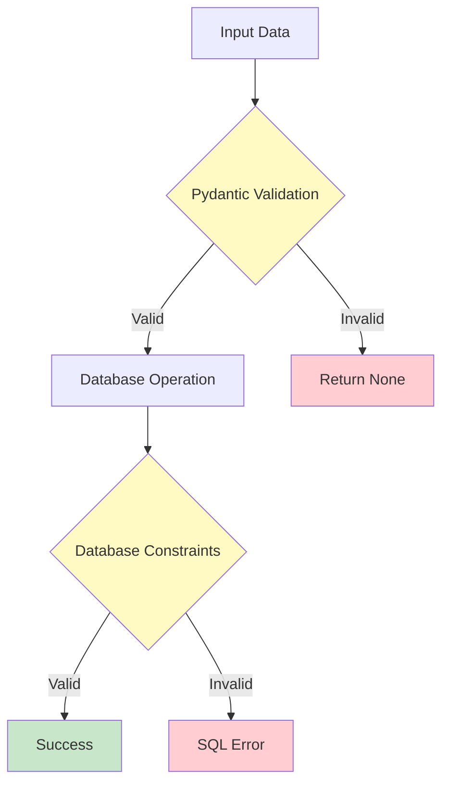

# Database Layer Specification

This document provides detailed specifications for the database layer of the Financial Tracker application.

## 📋 Overview

The application uses **SQLite 3.x** as its embedded relational database with a custom context manager pattern for connection management.

**Key Files**:
- [[db_manager.py]] - Database operations manager
- [[db_scripts_DDL.py]] - Schema definitions and initialization
- [[config.py]] - Database path configuration

**Database Location**: Configured via `DB_PATH` environment variable (default: `./data/fin_app.db`)

---

## 🗄️ Database Schema

**File**: [[db_scripts_DDL.py]]

### Users Table

```sql
CREATE TABLE IF NOT EXISTS users (
    id INTEGER PRIMARY KEY AUTOINCREMENT,
    name TEXT NOT NULL,
    email TEXT NOT NULL,
    created DATETIME DEFAULT CURRENT_TIMESTAMP,
    updated DATETIME DEFAULT CURRENT_TIMESTAMP
)
```

| Column | Type | Constraints | Description |
|--------|------|-------------|-------------|
| `id` | INTEGER | PRIMARY KEY, AUTOINCREMENT | Unique user identifier |
| `name` | TEXT | NOT NULL | User's full name |
| `email` | TEXT | NOT NULL | User's email address |
| `created` | DATETIME | DEFAULT CURRENT_TIMESTAMP | Creation timestamp |
| `updated` | DATETIME | DEFAULT CURRENT_TIMESTAMP | Last update timestamp |

**Indexes**: None (primary key index only)

**Constraints**:
- No unique constraint on email (allows duplicates)
- No email format validation at database level

---

### Transactions Table

```sql
CREATE TABLE IF NOT EXISTS transactions (
    id INTEGER PRIMARY KEY AUTOINCREMENT,
    user_id INTEGER NOT NULL,
    amount REAL NOT NULL,
    category TEXT NOT NULL,
    description TEXT NOT NULL,
    created DATETIME DEFAULT CURRENT_TIMESTAMP,
    updated DATETIME DEFAULT CURRENT_TIMESTAMP,
    FOREIGN KEY (user_id) REFERENCES users(id)
)
```

| Column | Type | Constraints | Description |
|--------|------|-------------|-------------|
| `id` | INTEGER | PRIMARY KEY, AUTOINCREMENT | Unique transaction identifier |
| `user_id` | INTEGER | NOT NULL, FOREIGN KEY | Reference to users table |
| `amount` | REAL | NOT NULL | Transaction amount |
| `category` | TEXT | NOT NULL | Transaction category |
| `description` | TEXT | NOT NULL | Transaction description |
| `created` | DATETIME | DEFAULT CURRENT_TIMESTAMP | Creation timestamp |
| `updated` | DATETIME | DEFAULT CURRENT_TIMESTAMP | Last update timestamp |

**Foreign Keys**:
- `user_id` → `users(id)` (no cascade delete configured)

**Indexes**: None (primary key and foreign key indexes only)

---

### Categories Table

```sql
CREATE TABLE IF NOT EXISTS categories (
    id INTEGER PRIMARY KEY AUTOINCREMENT,
    name TEXT NOT NULL
)
```

> [!NOTE]
> This table is **defined but not used** in the current implementation. Categories are validated via the [[Category]] enum in [[transaction.py]] instead.

---

## 🔧 Database Initialization

**File**: [[db_scripts_DDL.py]]

### `init_db()` Function

```python
def init_db():
    db_dir = os.path.dirname(DB_PATH)
    if db_dir and not os.path.exists(db_dir):
        os.makedirs(db_dir)
    
    with sqlite3.connect(DB_PATH) as conn:
        cursor = conn.cursor()
        cursor.execute(create_transactions_table)
        cursor.execute(create_categories_table)
        cursor.execute(create_users_table)
        conn.commit()
```

**Behavior**:
1. Creates parent directory if it doesn't exist
2. Creates database file if it doesn't exist
3. Creates all tables (idempotent - uses `IF NOT EXISTS`)
4. Auto-commits changes

**Called By**: [[DBManager.__init__]] when database file doesn't exist

---

## 💼 Database Manager

**File**: [[db_manager.py]]

### Class Overview

```python
class DBManager:
    conn = None
    db_path = None
```

The `DBManager` class provides:
- Context manager protocol for automatic connection management
- CRUD operations for users and transactions
- Data validation and conversion
- Connection safety checks

---

### Context Manager Protocol

#### `__init__(db_path: str = DB_PATH)`

```python
def __init__(self, db_path: str = DB_PATH):
    self.db_path = db_path
    self.conn = None
    # validate if sql db exists, if not create it
    if not os.path.exists(db_path):
        init_db()
```

**Purpose**: Initialize manager and ensure database exists

**Behavior**:
- Sets database path
- Initializes connection to None
- Creates database if it doesn't exist

---

#### `__enter__()`

```python
def __enter__(self):
    self.connect()
    return self  # SR: for with DBManager() as db:
```

**Purpose**: Enter context manager, establish connection

**Returns**: `self` for use in `with` statement

---

#### `__exit__(exc_type, exc_val, exc_tb)`

```python
def __exit__(self, exc_type, exc_val, exc_tb):
    self.disconnect()
```

**Purpose**: Exit context manager, close connection

**Behavior**: Automatically closes connection regardless of exceptions

---

### Connection Management

#### `connect()`

```python
def connect(self):
    self.conn = sqlite3.connect(self.db_path)
    self.conn.row_factory = sqlite3.Row
```

**Purpose**: Establish database connection

**Configuration**:
- Sets `row_factory` to `sqlite3.Row` for dict-like row access

---

#### `disconnect()`

```python
def disconnect(self):
    self.conn.close()
```

**Purpose**: Close database connection

---

#### `_check_connection()`

```python
def _check_connection(self):
    if self.conn is None:
        raise ConnectionError(
            "Database not connected. Use 'with DBManager() as db:'"
        )
```

**Purpose**: Validate connection before operations

**Raises**: `ConnectionError` if not used with context manager

---

## 👥 User Operations

### `add_user(name: str, email: str) -> User | None`

```python
def add_user(self, name: str, email: str) -> User | None:
    self._check_connection()
    cursor = self.conn.cursor()
    cursor.execute("INSERT INTO users (name, email) VALUES (?, ?)", (name, email))
    self.conn.commit()
    return self.get_user(cursor.lastrowid)
```

**SQL**: `INSERT INTO users (name, email) VALUES (?, ?)`

**Flow**:
1. Validate connection
2. Execute INSERT
3. Commit transaction
4. Retrieve and return created user

**Returns**: [[User]] model or None

---

### `get_user(user_id: int) -> User | None`

```python
def get_user(self, user_id: int) -> User | None:
    self._check_connection()
    cursor = self.conn.cursor()
    cursor.execute("SELECT * FROM users WHERE id = ?", (user_id,))
    row = cursor.fetchone()
    return User(**dict(row)) if row else None
```

**SQL**: `SELECT * FROM users WHERE id = ?`

**Flow**:
1. Validate connection
2. Execute SELECT
3. Fetch single row
4. Convert to dict and create [[User]] model
5. Return User or None if not found

---

### `list_users() -> list[User]`

```python
def list_users(self) -> list[User]:
    self._check_connection()
    cursor = self.conn.cursor()
    cursor.execute("SELECT * FROM users")
    rows = cursor.fetchall()
    return [User(**dict(row)) for row in rows]
```

**SQL**: `SELECT * FROM users`

**Flow**:
1. Validate connection
2. Execute SELECT
3. Fetch all rows
4. Convert each row to [[User]] model
5. Return list of Users

---

### `update_user(user_id: int, name: str, email: str) -> User | None`

```python
def update_user(self, user_id: int, name: str, email: str) -> User | None:
    self._check_connection()
    cursor = self.conn.cursor()
    cursor.execute(
        "UPDATE users SET name = ?, email = ? WHERE id = ?",
        (name, email, user_id),
    )
    self.conn.commit()
    return self.get_user(user_id)
```

**SQL**: `UPDATE users SET name = ?, email = ? WHERE id = ?`

**Flow**:
1. Validate connection
2. Execute UPDATE
3. Commit transaction
4. Retrieve and return updated user

> [!NOTE]
> The `updated` timestamp is **not** automatically updated. The database default only applies on INSERT.

---

### `delete_user(user_id: int) -> bool`

```python
def delete_user(self, user_id: int) -> bool:
    self._check_connection()
    cursor = self.conn.cursor()
    cursor.execute("DELETE FROM users WHERE id = ?", (user_id,))
    deleted_count = cursor.rowcount
    self.conn.commit()
    return deleted_count > 0
```

**SQL**: `DELETE FROM users WHERE id = ?`

**Flow**:
1. Validate connection
2. Execute DELETE
3. Check rowcount
4. Commit transaction
5. Return True if deleted, False otherwise

**Returns**: `bool` indicating success

---

## 💰 Transaction Operations

### `add_transaction(user_id: int, amount: float, category: str, description: str) -> Transaction | None`

```python
def add_transaction(
    self, user_id: int, amount: float, category: str, description: str
) -> Transaction | None:
    # Pydantic validation
    try:
        Transaction(
            user_id=user_id,
            amount=amount,
            category=category,
            description=description,
        )
    except ValidationError as e:
        print(f"Validation error: {e}")
        return None
    self._check_connection()
    cursor = self.conn.cursor()
    cursor.execute(
        "INSERT INTO transactions (user_id, amount, category, description) VALUES (?, ?, ?, ?)",
        (user_id, amount, category, description),
    )
    self.conn.commit()
    return self.get_transaction(cursor.lastrowid)
```

**SQL**: `INSERT INTO transactions (user_id, amount, category, description) VALUES (?, ?, ?, ?)`

**Validation**: Pre-insert validation using [[Transaction]] model

**Flow**:
1. Validate data with Pydantic
2. If invalid, print error and return None
3. Validate connection
4. Execute INSERT
5. Commit transaction
6. Retrieve and return created transaction

**Returns**: [[Transaction]] model or None

---

### `get_transaction(transaction_id: int) -> Transaction | None`

```python
def get_transaction(self, transaction_id: int) -> Transaction | None:
    self._check_connection()
    cursor = self.conn.cursor()
    cursor.execute("SELECT * FROM transactions WHERE id = ?", (transaction_id,))
    row = cursor.fetchone()
    return Transaction(**dict(row)) if row else None
```

**SQL**: `SELECT * FROM transactions WHERE id = ?`

**Flow**: Same as `get_user` but returns [[Transaction]]

---

### `list_transactions() -> list[Transaction]`

```python
def list_transactions(self) -> list[Transaction]:
    self._check_connection()
    cursor = self.conn.cursor()
    cursor.execute("SELECT * FROM transactions")
    rows = cursor.fetchall()
    return [Transaction(**dict(row)) for row in rows]
```

**SQL**: `SELECT * FROM transactions`

**Flow**: Same as `list_users` but returns list of [[Transaction]]

---

### `update_transaction(transaction_id: int, user_id: int, amount: float, category: str, description: str) -> Transaction | None`

```python
def update_transaction(
    self,
    transaction_id: int,
    user_id: int,
    amount: float,
    category: str,
    description: str,
) -> Transaction | None:
    # Pydantic validation
    try:
        Transaction(
            user_id=user_id,
            amount=amount,
            category=category,
            description=description,
        )
    except ValidationError as e:
        print(f"Validation error: {e}")
        return None

    self._check_connection()
    cursor = self.conn.cursor()
    cursor.execute(
        "UPDATE transactions SET user_id = ?, amount = ?, category = ?, description = ?, updated = CURRENT_TIMESTAMP WHERE id = ?",
        (user_id, amount, category, description, transaction_id),
    )
    self.conn.commit()
    return self.get_transaction(transaction_id)
```

**SQL**: `UPDATE transactions SET user_id = ?, amount = ?, category = ?, description = ?, updated = CURRENT_TIMESTAMP WHERE id = ?`

**Validation**: Pre-update validation using [[Transaction]] model

**Flow**:
1. Validate data with Pydantic
2. If invalid, print error and return None
3. Validate connection
4. Execute UPDATE with explicit `updated = CURRENT_TIMESTAMP`
5. Commit transaction
6. Retrieve and return updated transaction

> [!IMPORTANT]
> Unlike user updates, transaction updates **do** update the `updated` timestamp via explicit SQL.

---

### `delete_transaction(transaction_id: int) -> bool`

```python
def delete_transaction(self, transaction_id: int) -> bool:
    self._check_connection()
    cursor = self.conn.cursor()
    cursor.execute("DELETE FROM transactions WHERE id = ?", (transaction_id,))
    deleted_count = cursor.rowcount
    self.conn.commit()
    return deleted_count > 0
```

**SQL**: `DELETE FROM transactions WHERE id = ?`

**Flow**: Same as `delete_user`

---

## 🔄 Data Conversion Flow


**Key Step**: `User(**dict(row))` or `Transaction(**dict(row))`

This converts:
1. `sqlite3.Row` (database row object)
2. → `dict` (Python dictionary)
3. → `User`/`Transaction` (Pydantic model)

---

## 🎯 Design Patterns

### 1. Context Manager Pattern

```python
with DBManager() as db:
    user = db.get_user(1)
# Connection automatically closed
```

**Benefits**:
- Automatic resource cleanup
- Exception safety
- Clear scope of database operations

---

### 2. Repository Pattern

`DBManager` acts as a repository, abstracting database operations from business logic.

**Benefits**:
- Centralized data access
- Easier testing (can mock DBManager)
- Consistent error handling

---

### 3. Validation Pipeline



---

## ⚠️ Known Issues and Limitations

### 1. Missing Timestamp Updates

> [!WARNING]
> User updates do **not** update the `updated` timestamp. Only transaction updates do.

**Fix**:
```python
cursor.execute(
    "UPDATE users SET name = ?, email = ?, updated = CURRENT_TIMESTAMP WHERE id = ?",
    (name, email, user_id),
)
```

---

### 2. No Cascade Delete

> [!CAUTION]
> Deleting a user with transactions will fail due to foreign key constraint.

**Solutions**:
1. Add `ON DELETE CASCADE` to foreign key
2. Manually delete transactions before user
3. Use soft deletes instead

---

### 3. Validation Error Handling

Validation errors are printed but not propagated to the caller, making debugging difficult.

**Current**:
```python
except ValidationError as e:
    print(f"Validation error: {e}")
    return None
```

**Better**:
```python
except ValidationError as e:
    logger.error(f"Validation error: {e}")
    raise HTTPException(status_code=422, detail=str(e))
```

---

### 4. No Connection Pooling

Each context manager creates a new connection. For high-traffic applications, consider connection pooling.

---

### 5. No Transaction Support

Individual operations auto-commit. No support for multi-operation transactions.

**Example Need**:
```python
# Not currently possible
with DBManager() as db:
    user = db.add_user("Alice", "alice@example.com")
    db.add_transaction(user.id, 100.0, "Food", "Initial balance")
    # Both or neither should succeed
```

---

## 📚 Related Documentation

- **Data Models**: [[spec_pydantic.md]]
- **API Endpoints**: [[spec_server.md]]
- **Data Flow**: [[02_Data_Flow.md]]
- **Configuration**: [[config.py]]
