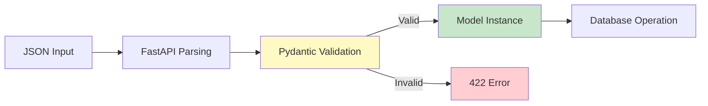
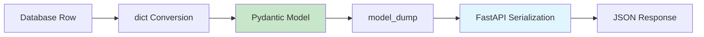

# Pydantic Models Specification

This document provides detailed specifications for all Pydantic models used in the Financial Tracker application.

## 📋 Overview

The application uses **Pydantic v2.12.5+** for data validation, serialization, and deserialization. All models inherit from `pydantic.BaseModel`.

**Location**: `fin_app/models/`

---

## 👤 User Model

**File**: [[user.py]]

### Class Definition

```python
from pydantic import BaseModel
from datetime import datetime

class User(BaseModel):
    id: int
    name: str
    email: str
    created: datetime
    updated: datetime
```

### Fields

| Field | Type | Required | Description | Validation |
|-------|------|----------|-------------|------------|
| `id` | `int` | Yes | Unique user identifier | Auto-generated by database |
| `name` | `str` | Yes | User's full name | Must be non-empty string |
| `email` | `str` | Yes | User's email address | Must be non-empty string |
| `created` | `datetime` | Yes | Creation timestamp | Auto-generated by database |
| `updated` | `datetime` | Yes | Last update timestamp | Auto-updated by database |

### Usage Examples

#### Creating a User Instance
```python
from fin_app.models.user import User
from datetime import datetime

user = User(
    id=1,
    name="Alice Smith",
    email="alice@example.com",
    created=datetime.now(),
    updated=datetime.now()
)
```

#### Validation
```python
# Valid
user = User(
    id=1,
    name="Bob",
    email="bob@test.com",
    created=datetime.now(),
    updated=datetime.now()
)

# Invalid - missing required field
try:
    user = User(id=1, name="Bob")  # Missing email, created, updated
except ValidationError as e:
    print(e)  # Will raise ValidationError
```

#### JSON Serialization
```python
user_dict = user.model_dump()
# {
#     'id': 1,
#     'name': 'Alice Smith',
#     'email': 'alice@example.com',
#     'created': datetime(...),
#     'updated': datetime(...)
# }

user_json = user.model_dump_json()
# '{"id":1,"name":"Alice Smith",...}'
```

### Database Integration

The User model is used in [[db_manager.py]] to:
1. **Deserialize** database rows into Python objects
2. **Validate** data integrity
3. **Serialize** for API responses

```python
# In DBManager.get_user()
row = cursor.fetchone()
return User(**dict(row)) if row else None
```

### Current Limitations

> [!NOTE]
> The User model currently lacks:
> - Email format validation (accepts any string)
> - Name length constraints
> - Unique email constraint enforcement at model level

### Potential Enhancements

```python
from pydantic import BaseModel, EmailStr, Field
from datetime import datetime

class User(BaseModel):
    id: int
    name: str = Field(..., min_length=1, max_length=100)
    email: EmailStr  # Validates email format
    created: datetime
    updated: datetime
    
    model_config = {
        "json_schema_extra": {
            "examples": [
                {
                    "id": 1,
                    "name": "Alice Smith",
                    "email": "alice@example.com",
                    "created": "2026-02-16T18:00:00",
                    "updated": "2026-02-16T18:00:00"
                }
            ]
        }
    }
```

---

## 💰 Transaction Model

**File**: [[transaction.py]]

### Class Definition

```python
from pydantic import BaseModel
from enum import Enum
from datetime import datetime

class Category(str, Enum):
    FOOD = "Food"
    TRANSPORT = "Transport"
    HOUSING = "Housing"
    ENTERTAINMENT = "Entertainment"
    OTHER = "Other"

class Transaction(BaseModel):
    id: int | None = None
    user_id: int
    amount: float
    description: str
    category: Category
    created: datetime | None = None
    updated: datetime | None = None
```

### Category Enum

The `Category` enum restricts transaction categories to predefined values.

| Value | Description | Use Case |
|-------|-------------|----------|
| `FOOD` | Food and dining | Groceries, restaurants |
| `TRANSPORT` | Transportation | Gas, public transit, taxi |
| `HOUSING` | Housing costs | Rent, utilities, maintenance |
| `ENTERTAINMENT` | Entertainment | Movies, games, hobbies |
| `OTHER` | Miscellaneous | Anything else |

#### Enum Usage

```python
from fin_app.models.transaction import Category

# Valid
category = Category.FOOD
print(category)  # Category.FOOD
print(category.value)  # "Food"

# String to Enum
category = Category("Food")  # Works
category = Category.FOOD  # Also works

# Invalid
category = Category("Invalid")  # Raises ValueError
```

### Transaction Fields

| Field | Type | Required | Default | Description | Validation |
|-------|------|----------|---------|-------------|------------|
| `id` | `int \| None` | No | `None` | Transaction identifier | Auto-generated by DB |
| `user_id` | `int` | Yes | - | Associated user ID | Must exist in users table |
| `amount` | `float` | Yes | - | Transaction amount | Any float value |
| `description` | `str` | Yes | - | Transaction description | Must be non-empty |
| `category` | `Category` | Yes | - | Transaction category | Must be valid Category enum |
| `created` | `datetime \| None` | No | `None` | Creation timestamp | Auto-generated by DB |
| `updated` | `datetime \| None` | No | `None` | Last update timestamp | Auto-updated by DB |

### Optional Fields Explained

The `id`, `created`, and `updated` fields are optional (`| None`) because:
- **On creation**: These are `None` and will be set by the database
- **On retrieval**: These are populated from the database

This allows the same model to be used for both:
1. **Input validation** (creating/updating transactions)
2. **Output serialization** (returning transactions from API)

### Usage Examples

#### Creating a Transaction (Input)
```python
from fin_app.models.transaction import Transaction, Category

# For API input - id, created, updated are None
transaction = Transaction(
    user_id=1,
    amount=50.0,
    description="Lunch at cafe",
    category=Category.FOOD
)
```

#### Transaction from Database (Output)
```python
from datetime import datetime

# From database - all fields populated
transaction = Transaction(
    id=1,
    user_id=1,
    amount=50.0,
    description="Lunch at cafe",
    category=Category.FOOD,
    created=datetime.now(),
    updated=datetime.now()
)
```

#### Validation Examples

```python
from pydantic import ValidationError

# Valid
t = Transaction(
    user_id=1,
    amount=100.0,
    category="Food",  # String automatically converted to enum
    description="Groceries"
)

# Invalid - wrong category
try:
    t = Transaction(
        user_id=1,
        amount=100.0,
        category="InvalidCategory",
        description="Test"
    )
except ValidationError as e:
    print(e)  # ValidationError: category must be valid Category

# Invalid - missing required field
try:
    t = Transaction(user_id=1, amount=100.0)
except ValidationError as e:
    print(e)  # ValidationError: missing required fields
```

### Database Integration

The Transaction model is used in [[db_manager.py]] for:

1. **Pre-insert Validation**:
```python
# In DBManager.add_transaction()
try:
    Transaction(
        user_id=user_id,
        amount=amount,
        category=category,
        description=description
    )
except ValidationError as e:
    print(f"Validation error: {e}")
    return None
```

2. **Deserialization**:
```python
# In DBManager.get_transaction()
row = cursor.fetchone()
return Transaction(**dict(row)) if row else None
```

### Current Limitations

> [!WARNING]
> Current validation gaps:
> - No minimum/maximum amount constraints
> - No description length limits
> - No validation for negative amounts (could be intentional for refunds)
> - Foreign key validation happens at database level, not model level

### Potential Enhancements

```python
from pydantic import BaseModel, Field, field_validator
from enum import Enum
from datetime import datetime

class Category(str, Enum):
    FOOD = "Food"
    TRANSPORT = "Transport"
    HOUSING = "Housing"
    ENTERTAINMENT = "Entertainment"
    OTHER = "Other"

class Transaction(BaseModel):
    id: int | None = None
    user_id: int = Field(..., gt=0)
    amount: float = Field(..., description="Transaction amount")
    description: str = Field(..., min_length=1, max_length=500)
    category: Category
    created: datetime | None = None
    updated: datetime | None = None
    
    @field_validator('amount')
    @classmethod
    def validate_amount(cls, v):
        if v == 0:
            raise ValueError('Amount cannot be zero')
        return v
    
    model_config = {
        "json_schema_extra": {
            "examples": [
                {
                    "id": 1,
                    "user_id": 1,
                    "amount": 50.0,
                    "description": "Lunch at cafe",
                    "category": "Food",
                    "created": "2026-02-16T18:00:00",
                    "updated": "2026-02-16T18:00:00"
                }
            ]
        }
    }
```

---

## 🔄 Model Lifecycle

### Request Flow



### Response Flow



---

## 🎯 Best Practices

### 1. Always Use Models for Validation

```python
# Good - validates before database operation
try:
    Transaction(user_id=user_id, amount=amount, category=category, description=description)
except ValidationError:
    return None

# Bad - no validation
cursor.execute("INSERT INTO transactions VALUES (?, ?, ?, ?)", (...))
```

### 2. Use Type Hints

```python
# Good
def get_user(self, user_id: int) -> User | None:
    ...

# Bad
def get_user(self, user_id):
    ...
```

### 3. Leverage Pydantic Serialization

```python
# Good - automatic serialization
return user.model_dump()

# Bad - manual dict creation
return {
    "id": user.id,
    "name": user.name,
    ...
}
```

---

## 📚 Related Documentation

- **Database Integration**: [[spec_database.md]]
- **API Endpoints**: [[spec_server.md]]
- **Data Flow**: [[02_Data_Flow.md]]
- **Pydantic Documentation**: https://docs.pydantic.dev/

---

## 🔍 Model Comparison

| Aspect | User | Transaction |
|--------|------|-------------|
| **Optional Fields** | None | `id`, `created`, `updated` |
| **Enums** | None | `Category` |
| **Foreign Keys** | None | `user_id` → users.id |
| **Validation** | Basic type checking | Type + enum validation |
| **Use Cases** | User management | Financial tracking |
